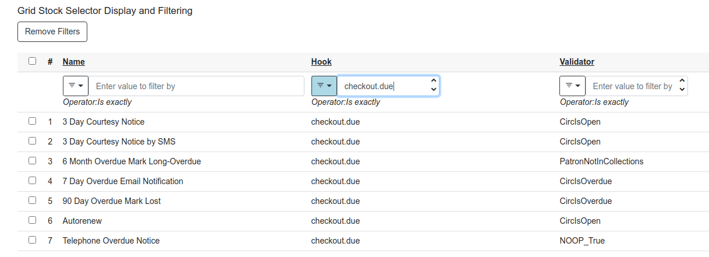

# Angular Ingredients

### A Hodgepodge

2020 Evergreen Online Conference

Bill Erickson

Software Development Engineer

King County Library System

---

# Grid Markup Flex

Using 'flex'

    !html
    <eg-grid-column name="id" i18n-label label="ID" flex="1">
    </eg-grid-column>
    <eg-grid-column name="title" i18n-label label="Title" flex="3">
    </eg-grid-column>

---

# Grid Cell Text Generator (Printing)

## Markup

    !html
    <eg-grid [cellTextGenerator]="cellTextGenerator" ...>
      <eg-grid-column i18n-label label="Barcode" name="barcode"
         [cellTemplate]="barcodeTemplate"></eg-grid-column>
    </eg-grid>

## Code

    !typescript
    this.cellTextGenerator = {
        barcode: row => row.barcode
    };

---

# Org Family Select

---

# Org Family Select

    !html
    <eg-org-family-select
      [limitPerms]="viewPerms"
      [selectedOrgId]="contextOrg.id()"
      [(ngModel)]="searchOrgs"
      (ngModelChange)="grid.reload()">
    </eg-org-family-select>

Interface for ngModel:

    !typescript
    export interface OrgFamily {
        primaryOrgId: number;
        includeAncestors?: boolean;
        includeDescendants?: boolean;
        orgIds?: number[];
    }

---

# Date Pickers

---

# Accesskey Help Dialog (ctrl+h)

---

# egAccesskey Directive

    !html
    <a routerLink="/staff/circ/patron/search"
      egAccessKey keyCtx="navbar"
      i18n-keySpec keySpec="alt+s f4"
      i18n-keyDesc keyDesc="Patron Search"
      i18n>
      Patron Search
    </a>
---

# PCRUD Flesh Selectors and Format Service

    !typescript
	this.pcrud.retrieve('cmf', 1, {}, {fleshSelectors: true})
	.subscribe(field => {
		console.log('Metabib Field Class',
			this.format.transform({
				value: field.field_class(), //  'cmc' object
				idlClass: 'cmf',
				idlField: 'field_class'
			})
		);
	});	

logs => Metabib Field Class Series

---

# egContextMenu Directive

---

# egContextMenu Directive

    !html
    <input
        [egContextMenu]="contextMenuEntries()"
        (menuItemSelected)="contextMenuChange($event.value)"
    />

---

# eg-string Component

## HTML

    !html
    <eg-string #successMsg i18n-text
        text="Setting Update Succeeded"></eg-string>

    <b>{{successMsg.text}}</b>

## SCRIPT

    !typescript
    @ViewChild('successMsg') successMsg: EgString;
    this.toast.success(this.successMsg.text);

---

# eg-string Component

## HTML

    !html
    <ng-template #searchName let-tab="tab" let-query="query" i18n>
      <ng-container [ngSwitch]="tab">
        Search:
        Identifier:
        MARC:
        Browse:
      </ng-container> {{query}}
    </ng-template>

    <eg-string key='eg.catalog.recent_search.label'
        [template]="searchName"></eg-string>

## SCRIPT

    !typescript
    this.strings.interpolate(
        'eg.catalog.recent_search.label',
        {query: query, tab: this.searchTab}
    ).then(txt => this.searchLabel = txt);

---

# Angular 9 $localize in Code

	!typescript
	@Component({
	  template: '{{ title }}'
	})
	export class HomeComponent {
	  title = $localize`You have 10 users`;
	}

> You can then translate the message the same way you would for a
> template.  But, right now (v9.0.0), the CLI does not extract these
> messages with the xi18n command as it does for templates.

Source: https://blog.ninja-squad.com/2019/12/10/angular-localize/

---

# Config Fields: New IDL Option for Admin UIs

Z39.50 Source IDL "Attrs" Field

    !xml
    <field
        reporter:label="Attrs" name="attrs"
        oils_persist:virtual="true"
        reporter:datatype="link"
        config_field="true"/>

---

# ConfigFields: Create Links

---

# Admin Page Grid URL Filters

---

# General Purpose Grid Filters

---

# General Purpose Grid Filters

## Collection of filters that can be passed pcrud (or other API)

    !typescript
    this.gridDataSource.filters === 
        {"hook":[{"hook":{"=":"checkout.due"}}]}

---

# Server Print Templates

---

# Serial vs Parallel requests

Will someone please think of the servers!?

	!typescript
    load(): Promise<any> {
        this.loading = true;

        // 4 requests hit the server at the same time
        return Promise.all([
            this.getThing1(),
            this.getThing2(),
            this.getThing3(),
            this.getThing4()
        ]).then(_ => this.loading = false);
    }

---

# Serialize Requests
Use serialized requests by default and parallelize with care as neeeded.

	!typescript
    load() {
        this.loading = true;

        this.getThing1()
        .then(_ => this.getThing2())
        .then(_ => this.getThing3())
        .then(_ => this.getThing4())
        .then(_ => this.loading = false);
    }

---

# Route Reuse

* ngOnInit() is called once per component instantiation
* Components can persist across route changes.
* If a route change should change what data the component uses, it will
  have to be retrieved without the help of ngOnInit
* E.g. Angular catalog record detail navigating results

---

# Responding to Component Variable Changes

---

# Route-level components: Route Changes

    !typescript
    ngOnInit() { // this.route === ActivatedRoute

        this.route.paramMap.subscribe((params: ParamMap) => {
            // FIRES ON PAGE LOAD
            const recId = +params.get('recordId');
            if (recId !== this.recordId) {
                this.load();
            }
        });
    }

    load() {
        // Reset component state / variables
        // Load data
    }

---

# Child Components: @Input() changes

    !typescript
    initDone = false;
    private _recordId: number;
    @Input() set recordId(id: number) {

        if (id !== this._recordId) {
            this._recordId = id;

            // Avoid collecting data before ngOnInit()
            if (this.initDone) { this.load(); }
        }
    }

    get recordId(): number { return this._recordId; }

    ngOnInit() {
        this.load().then(_ => this.initDone = true);
    }
    
    load(): Promise<any> { if (this.recordId) { ... } }

---

# @Input() set foo() beware...

* Similar to AngJS $watch('scopeVar')
* @Input() setter functions should only be used when changing inputs
  require action by the component, e.g. fetching new data.

---

# import {tap} from 'rxjs/operators';

Processing Observable streams then  producing a Promise.

    !typescript
    return this.pcrud.search('acp', {call_number: cnId})
    .pipe(
        tap(
            copy => this.processCopy(copy)
        )
    ).toPromise()

---

# Misc. Suggestions

---

# Symlink Angular Build Path for Instant Deployments

Change path to suit your development environment.

    !sh
    $ ln -s \
        /path/to/Evergreen/Open-ILS/web/eg2/en-US \
        /openils/var/web/eg2/en-US

    # When coding
    $ ng build --watch # separate terminal

---

# Bookmark UIs Under Development

---

# Remove Trailing Whitespace

~/.vimrc option to auto-trim trailing whitespace (ng lint)

    !vim
    " Strip trailing whitespaces from Typescript files
    autocmd BufWritePre *.ts %s/\s\+$//e

---

# ng build --prod Can Be Instructive

Templates are compiled.

---

# Thanks!

Questions?

