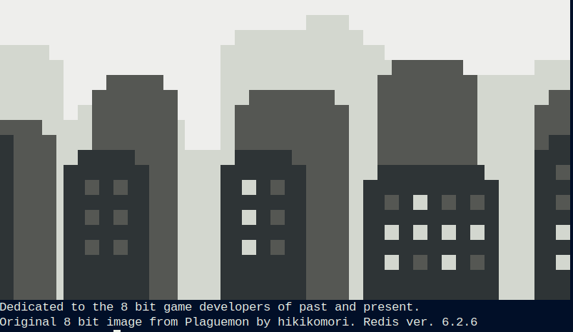

# OpenSRF -> RediSRF ?

### 2022 Evergreen Online Conference

Bill Erickson

Software Development Engineer

King County Library System

* [Slides as Markdown](https://github.com/berick/Presentations/tree/master/Evergreen-2022/osrf-redis.md)
* [Slides as HTML](https://github.com/berick/Presentations/tree/master/Evergreen-2022/osrf-redis.html)

---

# Why Replace XMPP / Ejabberd?

## It's haunted, but also...

* Complications with changing hostnames
* Authentication changes
* Apparmor interactions.
* Install issues in LXD guests
* Responding to XMPP spec changes
* There may be better options

---

# Redis

[redis.io](https://redis.io/)

> The open source, in-memory data store used by millions of developers as a 
> database, cache, streaming engine, and message broker.

[Stack Overflow Developer Survey](https://insights.stackoverflow.com/survey/2021#section-most-loved-dreaded-and-wanted-databases)

> Redis is in its fifth year as the most loved database in Stack Overflow's 
> developer survey.

---

# Why Redis?

* Speed
* Resource Usage
* Trivial to get started
* It does a few things very well
* Ease of Installation and Configuration
* Native Debugging Tools & Stats Collection
* Open-source, C-based, liberally licensed.

---

# How Does This Work?

    RPUSH service:open-ils.actor <OSRF-REQUEST-JSON>

    BLPOP service:open-ils.actor

    RPUSH client:515aad3bfbc2 <OSRF-RESPONSE-JSON>

    BLPOP client:515aad3bfbc2

    RPUSH client:515aad3bfbc2 <OSRF-RESPONSE-2-JSON>

    BLPOP client:515aad3bfbc2

    # ...
    # Connected clients send follow-up requests to ther worker address

    RPUSH client:open-ils.actor:d12252828cb2 <OSRF-REQUEST2-JSON>

---

# Fundamental Differences

* No More OpenSRF Routers
* Bus messages are JSON
* Changes to opensrf_core.xml

---

# What Does the OpenSRF Router Do?

* Routes requests to one or more Listeners
* Provides separate destinations for public vs. private services
* Knows what services are actively running for a domain.

---

# RediSRF in Action

---

# Install

[README_REDIS.md](https://github.com/berick/OpenSRF/blob/user/berick/lpxxx-opensrf-via-redis-v4-auth-exp-2/README_REDIS.md)

---

# Timing

* Demo timer script
* Demo Catalog with
* Demo Server Admin -> Search Facet Fields

---

# Debugging Tools:

    % redis-cli monitor

    % redis-cli memory stats

    % redis-cli client help

    % redis-cli client list # e.g. tot-mem

    $ redis-cli --bigkeys

    % redis-cli keys client:* 

      1) "client:opensrf.settings:f67a1bb2188e"

      2) "client:opensrf.settings:c9e470abf2c3"

---

# Opportunities

* Direct-to-drone request delivery.
* Could replace memcache / optional key persistence & Replication
* OpenSRF request "backlog" not required.
* Do we need chunking/bundling?

---

# Limitations

### No cross-domain (i.e. cross-brick) routing.

* Affects some Dojo/translator UI's
    * Bricks that share a Redis instance could still cross-communicate

### No support for max list entry size

* Could be enforced in the OpenSRF client libs.
    * websocket-osrf already has 10M limit

### No auto-expire for keys

* Trivial to script "delete all keys older than X"
    * [Example Script](https://stackoverflow.com/questions/16517439/redis-how-to-delete-all-keys-older-than-3-months)

---

# Securing Private Services

If we no longer have public and private XMPP domains...

* ACL's to prevent access to private services
    * 3 accounts: 'default', 'opensrf@public', and 'opensrf@private'
    * See osrf_control --reset-message-bus
* Gateway additionally verifies requests for public services as an added 
  security layer and to prevent requests going to nonexistent end points.

---

# More TODO

### In-Bus Registry of Running Services (If Needed).

Circ, for example, queries the router to see if Booking is running.  
Could be addressed with configuration (e.g. global flag)

### LP, Cleanup, Docs

---

# Let's Talk

