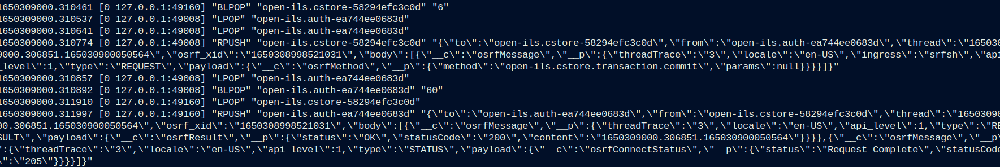

# OpenSRF-Over-Redis

### Exploring Replacing Ejabberd/XMPP For OpenSRF

2022 Evergreen Online Conference

Bill Erickson

Software Development Engineer

King County Library System

https://github.com/berick/Presentations/tree/master/Evergreen-2022

---

# Why Replace Ejabberd / XMPP?

Ejabberd install and setup has traditionally been one of the clunkiest parts 
of the Evergreen/OpenSRF installation.

Authentication changes https://bugs.launchpad.net/opensrf/+bug/1703411 

---

# Redis

[redis.io](https://redis.io/)

> The open source, in-memory data store used by millions of developers as a 
> database, cache, streaming engine, and message broker.

[Stack Overflow Developer Survey](https://insights.stackoverflow.com/survey/2021#section-most-loved-dreaded-and-wanted-databases)

> Redis is in its fifth year as the most loved database in Stack Overflow's 
> developer survey.

---

# RediSRF in Action

---

# Install

## Prereqs

    % sudo apt install redis-server libredis-perl libhiredis-dev

## Branches

* TODO
* TODO

---

# Timing

TODO timer script / demo

---

# Debugging Tools:

    % redis-cli monitor

---

# Fundamental Differences

* No More OpenSRF Routers
    * Clients deliver requests directly to the service address.
* Bus messages are JSON
* Clients pull messages instead of recieving + caching them.
* Redis accounts/authentication optional

---

# Benefits

* Speed
* Ease of Installation and Configuration
* Slimmer Bus Messages / Less Packing & Unpacking
* Intuitive Flow of Data
* Say Goodbye to Ejabberd

---

# Opportunities

* Direct-to-drone request delivery.
* Sending broadcast/control messages to listeners.
    * Shutdown, reload, dynamically raise max children, etc.
    * Requests for data, e.g. drone stats (similar to router info messages)
* OpenSRF request "backlog" no longer required.  Unprocessed requests
  stay in the Redis message queue instead of filling up the
  listener's network buffer.

---

# Limitations

* No cross-domain (i.e. cross-brick) routing.
    * Affects some Dojo/translator UI's
    * NOTE: Bricks that share a Redis instance could still cross-communicate
* Requests sent to a service that is not running will linger unanswered
  instead of resulting in a not-found response.

# Pending Work

* Securing Private Services (e.g. Internal API Key)
* In-Bus Registry of Running Services (If Needed).
    * Circ, for example, queries the router to see if Booking is running.
      Could be addressed with configuration (e.g. global flag)
* Docs

---

# How Does That Make You Feel?

