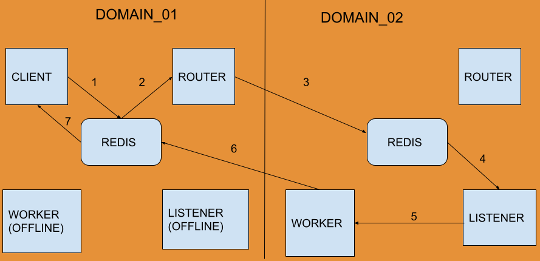

# XMPP/Ejabberd to Redis Update

2023 Evergreen Conference

Worcester, Massachusetts

Bill Erickson

Software Development Engineer, King County Library System

[https://github.com/berick/Presentations/tree/main/Evergreen-2023](
    https://github.com/berick/Presentations/tree/main/Evergreen-2023)

---

# Evergreen 2022

[https://github.com/berick/Presentations/blob/main/Evergreen-2022/osrf-redis.md](
    https://github.com/berick/Presentations/blob/main/Evergreen-2022/osrf-redis.md)

## While We're Talking Ejabberd: 

[https://github.com/berick/evergreen-ansible-installer/tree/ubuntu-22.04#evergreen--opensrf-ansible-installer](
    https://github.com/berick/evergreen-ansible-installer/tree/ubuntu-22.04#evergreen--opensrf-ansible-installer)

---

# Redis Recap

> The open source, in-memory data store used by millions of developers 
> as a database, cache, streaming engine, and message broker.

* [https://redis.io/](https://redis.io/)
* [Developer Survey](
    https://survey.stackoverflow.co/2022/#section-most-loved-dreaded-and-wanted-databases)

---

# XMPP V. Redis

### Jabber

  

### Redis

  

---

# Additional Design Considerations

1. Cross-Domain Routing
1. Redis Message Streams
1. Minimal upgrade requirements

---

# 1. Multi-Domain Routing

Long Live the OpenSRF Router!

* High-Availability
* Additional Layer of Security (domain segmentation)
* Backwards Compatible with the OpenSRF Translator / Dojo UI's

---

# High Availability

---

# Routable Addresses

## Structure

    !sh
     [prefix]
      :[purpose]
        :[domain|service-name]
          :[hostname]
            :[service-name] (OPTIONAL)
              :[pid]
                :[random]

### Examples

* opensrf:service:open-ils.cstore
* opensrf:router:private.localhost
* opensrf:client:private.localhost:eg22:848908:330137
* opensrf:client:private.localhost:eg22:open-ils.cstore:848908:330137

---

# Router

[Router v1](https://github.com/kcls/evergreen-universe-rs/blob/main/opensrf/src/bin/router.rs)

    !sh
    srfsh# request router opensrf.router.info.class.list

    Received Data: [
      "opensrf.settings",
      "open-ils.cat",
      "opensrf.math",
      "open-ils.search",
      "open-ils.booking",
      "open-ils.supercat",
      "open-ils.acq",
      "opensrf.dbmath",
      "open-ils.actor",
      "open-ils.justintime",
      "open-ils.reporter",
      "open-ils.collections",
      "open-ils.auth_proxy",
      "open-ils.auth",
      "open-ils.trigger",
      "open-ils.url_verify",
      "open-ils.vandelay",
      "open-ils.permacrud",
      ...
--- 

# A Brief Detour...

--- 

# [Fun With Rust](https://www.rust-lang.org/)

[KCLS Evergreen Rust Universe](
    https://github.com/kcls/evergreen-universe-rs)

---

# Rust Stuff We Could Use

* Router
* Websocket Translator
    * Remove websocketd dependency
    * Per-Service Active Request [Throttling](
        https://redis.demo.kclseg.org/eg2/en-US/staff/sandbox)

---

# More Rust Stuff We Could Use

* JSON HTTP Gateway
    * [Additional formats](
        https://redis.demo.kclseg.org/eg-http-gateway?service=open-ils.actor&method=open-ils.actor.org_tree.retrieve&format=raw)
* OpenSRF Server
    * [open-ils.rspub](
        https://redis.demo.kclseg.org/eg-http-gateway?service=open-ils.rspub&method=opensrf.system.echo&param=[%22HELLO%22,%20%22WORLD%22])
* egsh

---

# Router / Summarize

    !json
    {
      "listen_address": "opensrf:router:private.localhost",
      "primary_domain": {
        "domain": "private.localhost",
        "route_count": 1484,
        "services": [ {
          "name": "opensrf.settings",
          "route_count": 10,
          "controllers": [ {
              "address": "opensrf:client:private.localhost:eg22.lxd::opensrf.settings:1771487:9698073",
              "register_time": "2023-03-15T12:35:15.852677162-04:00"
          } ] 
        }, {
          "name": "open-ils.cat",
          "route_count": 1,
          "controllers": [ {
              "address": "opensrf:client:private.localhost:eg22.lxd::open-ils.cat:1771516:8781771",
              "register_time": "2023-03-15T12:35:16.402692131-04:00"
            } ]
        },
        ...
---

# ...And We're Back

---

# 2. Message Streams

[https://redis.io/docs/data-types/streams-tutorial/](https://redis.io/docs/data-types/streams-tutorial/)

* Observability
* Access Ranges of Messages
* Retains Messages over Time (by default)
* Multiple Delivery Targets/Groups
* Ability to ACK message

---

# List Example

    !sh
    127.0.0.1:6379> RPUSH mylist apple
    (integer) 1
    127.0.0.1:6379> RPUSH mylist banana
    (integer) 2
    127.0.0.1:6379> RPUSH mylist pineapple
    (integer) 3
    127.0.0.1:6379> BLPOP mylist 60
    1) "mylist"
    2) "apple"

---

# Stream Example

    !sh
    127.0.0.1:6379> XGROUP CREATE mystream mygroup $ MKSTREAM   
    OK
    127.0.0.1:6379> XADD mystream MAXLEN ~ 1000 * message apple
    "1682455235361-0"
    127.0.0.1:6379> XADD mystream MAXLEN ~ 1000 * message banana
    "1682455250495-0"
    127.0.0.1:6379> XADD mystream MAXLEN ~ 1000 * message pineapple
    "1682455255516-0"
    127.0.0.1:6379> XREADGROUP GROUP mygroup myself BLOCK 6000 COUNT 1 NOACK STREAMS mystream >
    1) 1) "mystream"
       2) 1) 1) "1682455235361-0"
             2) 1) "message"
                2) "apple"

---

# Streams: Takeway

* Streams work, are slightly more complicated, offer some theoretical benefits.
* However...
* [Revert / Recover Stream Support](
    https://git.evergreen-ils.org/?p=working/OpenSRF.git;a=commitdiff;h=def7018b08c41e3b03e41e145deb638929981548)

---

# 3. Minimal Upgrade Requirements

* Use Existing Configs
* New config file: [/openils/conf/redis-accounts.txt[.example]](
    https://github.com/berick/OpenSRF/blob/user/berick/lpxxx-opensrf-over-redis-v2/examples/redis-accounts.example.txt)
    * `osrf_control --reset-message-bus`
    * TODO: Generate random passwords at build time

---

# Kicking the Tires

* [OpenSRF Working Branch](
    https://git.evergreen-ils.org/?p=working/OpenSRF.git;a=shortlog;h=refs/heads/user/berick/lpxxx-opensrf-over-redis-v3)
* [Evergreen Working Branch](
    https://git.evergreen-ils.org/?p=working/Evergreen.git;a=shortlog;h=refs/heads/user/berick/lpxxx-opensrf-over-redis-v3)
* [Demo Site](https://redis.demo.kclseg.org/eg2/staff/splash)
* [Ansible Installer](
    https://github.com/berick/evergreen-ansible-installer/tree/working/ubuntu-22.04-redis)

---

# In Future

* Direct-to-drone request delivery
    * Avoid listener chokepoints
    * I have Perl patches for this.
* Replace Memache with Redis
    * E.g. Authtokens could be more durable with Redis disk persistance.

---

# OK, what now?

* Open a LP ticket
* Decide on a path for Router, Websockets
* Generate bus passwords at install time
* Migrate Rust code to community repositories?
* Finalize install documentation

---

