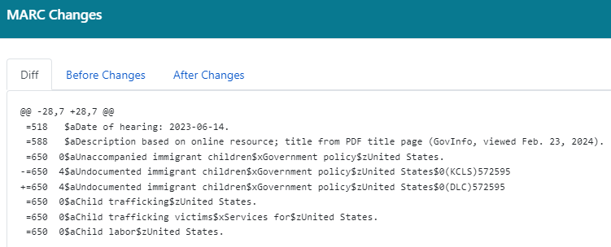
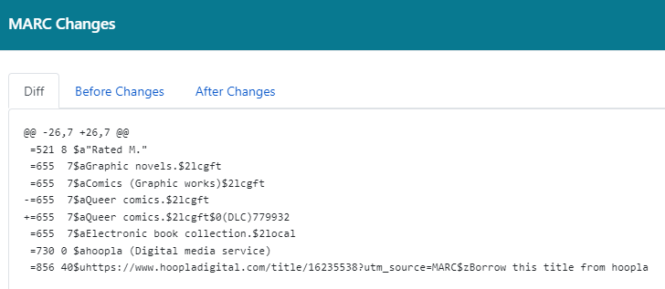

<!-- class: invert -->

<!-- Building: marp -w marc-search-replace.md -->

# MARC Search & Replace

2024 Evergreen Conference

Bill Erickson

Software Development Engineer, King County Library System

[https://github.com/berick/Presentations/tree/main/Evergreen-2024](
    https://github.com/berick/Presentations/tree/main/Evergreen-2024)

---

# Start With the Basics

---

# Removing a Row

* ```=3.*```

---

# Adding a Row

* ```(=245.*)```
* ```$1\n=246 1 \$aMY-246```

---

# How are Catalogers Using It?

---

# Cleanup

> We wanted to remove this sentence that appeared at the end of a 520 
> (Summary) field in hundreds of records for OverDrive audiobooks.

* Search Regex: ```^(=520 ...*.)( Contains mature themes)(\.)$```
* Replace Regex: ```$1```

---

# Authority Repairs

> I did a MARC search for 650 fields with subfield zero (0) that has 
> `KCLS` instead of `DLC`. There are 14 records in Production that currently 
> match these criteria.

* Search Regex: ```^(=650 .[04]\$a.*\$0)(\(KCLS\))(.{4,6})$```
* Replace Regex: ```$1(DLC)$3```
* 

---

# Authority Repairs

> I searched for the subject “Queer comics” limited to eBook records. I 
> added 130 records to a record bucket. This regular expression can add 
> the authority linking ID to the end of the record only if it lacks it.

> The second record in the bucket matched the expression criteria:

* Search Regex: ```^(=655 .7)(\$)(aQueer comics\.\$2lcgft)$```
* Replace Regex: ```$1$2$3${2}0(DLC)779932```
* 

--- 

# Electronic Dance Music!

> We wanted to change `Underground` dance music to `Electronic` dance music 
> OCLC `Fast` and our local headings.

* Search Regex: ```^(=650 .7.a)(Underground)( dance music.*2fast.*[0-9])$```
* Replace Regex: ```$1Electronic$3```
* Search Regex: ```^(=650 .7.a)(Underground)( dance music.*2local)$```
* Replace Regex: ```$1Electronic$3```

--- 

# What's Next

* Dry-Run Option
* Launchpad


